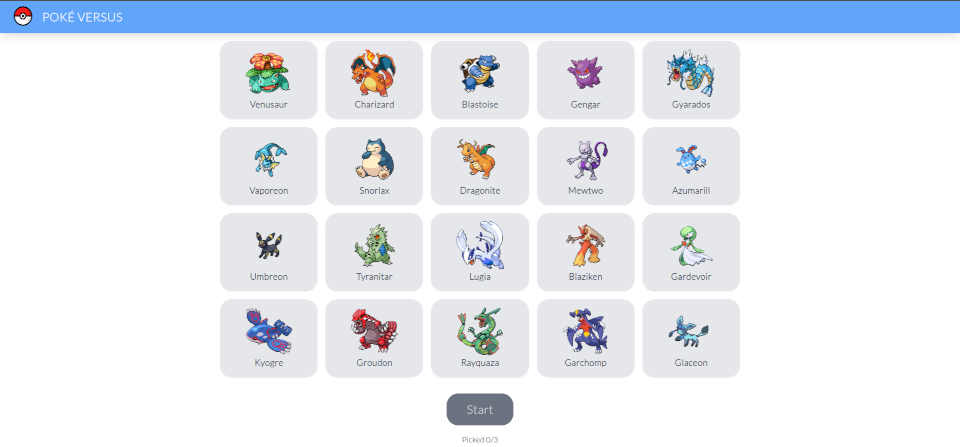
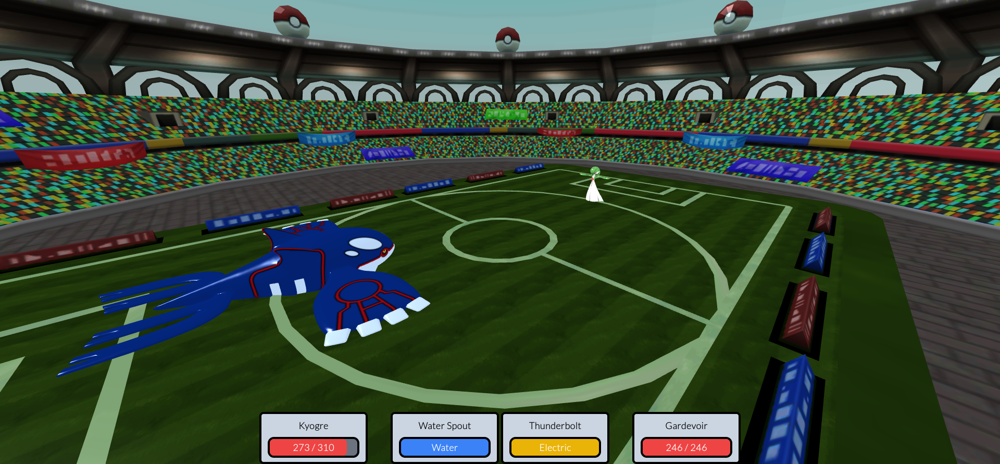

# Poké Versus




# Introduction

Poké Versus is a simple 1v1 pokemon game I decided to make as my websocket project for a university class.
Each player uses a website to connect to the server via a websocket. Server then connects two players
and acts as a middle ground passing messages between them. Server can handle up to 256 concurrent games.

Frontend is written in Svelte. My language of choice was TypeScript. To not have to deal with plain CSS I used TailwindCSS. Game scene is rendered
with Three.js and Svelte Cubed.

Backend is written in Kotlin + KTOR.

# How to run

### 1. Frontend Server

- Enter "frontend" directory

- Install dependecies

```bash
npm install
```

- If game will be played on multiple machines
set server's IP in config.ts

- Run on local machine

```bash
npm run dev
```

### 2. Backend Server

Open project in Intellij IDEA and run

# Disclaimer

This implementation is extremely unsecure. There is no server side validation done so for the whole system to work
both players will have to play fair.

This is by no means a finished game as there is no animations, sounds and it is even missing some of the core features like swapping to a different pokemon.

I do not own any of the assets used.

# Communitcation protocol

### Commonly used values

| Name          | Meaning                                   | Possible Values |
| ------------- | ----------------------------------------- | --------------- |
| Message type  | Value specyfing which message was received| 0..4            |
| Pokemon ID    | Index specifying a species of pokemon     | 0..24           |
| Game ID       | Number used to differentiate games        | 0..255          |
| Player Number | Player with number 1 starts               | 0 or 1          |

### Join Game Message (type = 0)

Client sends this message when he wants to start a game. Message contains a list of chosen pokemon IDs.

| Byte | Content           |
| ---- | ----------------- |
| 0    | Message type      |
| 1    | First pokemon ID  |
| 2    | Second pokemon ID |
| 3    | Third pokemon ID  |

### Opponent Joined Message (type = 1)

Server sends this message to both clients provided they both sent "Join Game" message first.
Message contains a list of their opponent's pokemon IDs.

| Byte | Content            |
| ---- | ------------------ |
| 0    | Message type       |
| 1    | First pokemon ID   |
| 2    | Second pokemon ID  |
| 3    | Third pokemon ID   |
| 4    | Game ID            |
| 5    | Player Number      |

### Attack Message (type = 2)

Client sends this message to server after chosing an attack. If this attack will
cause the player to win then Game Won byte is set to 1. Using this server
will be able to clean up after game.

| Byte | Content          |
| ---- | ---------------- |
| 0    | Message type     |
| 1    | Game ID          |
| 2    | Amount of damage |
| 3    | Game won         |
| 4    | Player Number    |

### Receive Damage Message (type = 3)

Server sends this message to client after receiving "Attack" message from that player's opponent.

| Byte | Content          |
| ---- | ---------------- |
| 0    | Message type     |
| 1    | Amount of damage |

### Reconnect Message (type = 4)

Clients sends this message to server after website is reloaded so server will update connection.

| Byte | Content       |
| ---- | ------------- |
| 0    | Message type  |
| 1    | Player Number |
| 2    | Game ID       |
